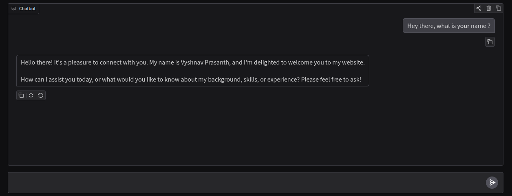

# PersonalAgent
Personal AI assistant that independently communicates with website visitors, answers questions, and provides context-aware information about my skills, projects, and experience.

## Requirements

Before running the project, make sure to do the following:

1. **Install Python dependencies**  
   Run the command:

   ```bash
   pip install -r requirements.txt

2. **Make sure these files exist in the project folder:**
    
    1.Profile.pdf → your resume

    2.summary.txt → summary of your profile


## UI

